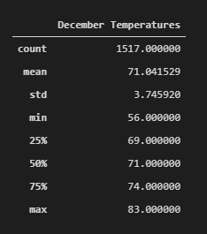
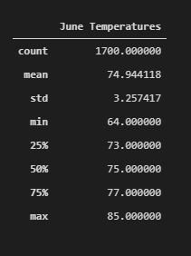

# surfs_up

## Overview of the Analysys 
	- The purpose of this analysis is to help W. Avy get more information about temperature trends before opening her shop. 
		* specifically for the months of June and December in Ohau.
		* to get a basis of how sustainable the surf and ice cream shop business would be year-round.

## Results
 - The results for the temperature trends for June and December in Ohau are below:
	* First we account for the standard deviaton of both December and June's temperatures of 3.
	* After looking at the data we can see that the difference in minimun average temparatures are about 10 degrees.
		- This can be expected being that its December and the coldest it can get would be 50 to 56 degrees.
	* we can also see that December has rather hot days too with the maximum average temepratures reaching 83 degrees.
		-This is only 2 degree difference compared to June.
	* Finally looking at the 25%,50%,75% averages we can see that there is only a 3 - 4 difference in temperatures.
	* The output of both months can be inspeceted below.
	*    
	
## Summary
- Based off our findings above I can concloude that W. Avy can definitly hold up with a Surf/Ice Cream shop year round. Although he should consider a 
  running a special in the winter months to attract more customers. 
